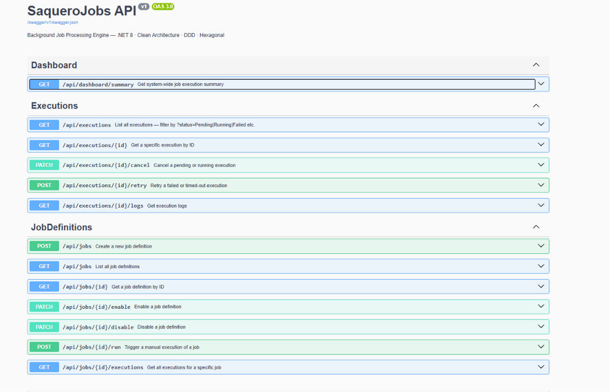
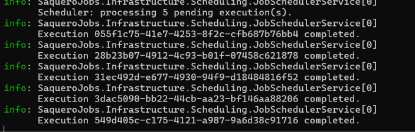
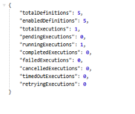
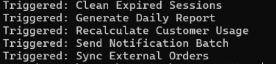

<p align="center">
  
</p>

<h1 align="center">SaqueroJobs</h1>
<p align="center">Background Job Processing Engine — .NET 8 · Clean Architecture · DDD · Hexagonal Architecture</p>

<p align="center">
  
  
  
  
  
  
</p>

---

## What is SaqueroJobs?

SaqueroJobs is a production-style background job processing engine built with **.NET 8**.

It simulates how real enterprise platforms handle background work: defining jobs, triggering executions, tracking lifecycle states, logging execution steps, and retrying failures — all with clean architecture and a professional API surface.

This is not a CRUD. It is a backend engine that demonstrates real system design thinking.

---

## Preview

### Swagger UI — 14 endpoints across 3 groups

[](assets/swagger-ui.png)

### Scheduler — Processing 5 concurrent executions

[](assets/scheduler-logs.png)

### Dashboard Summary — Real-time execution monitoring

[](assets/dashboard.png)

### Health Check — Service status endpoint

[](assets/health-check.png)

---

## Key Design Decisions

**JobDefinition and JobExecution are separate aggregates.** Defining a job and running it are different concepts. A `JobDefinition` is a template — it holds the type, retry policy, cron expression and enabled state. A `JobExecution` is a record of one run — it owns its lifecycle, its logs, its attempt number.

**RetryPolicy is a Value Object.** It is not a pair of loose fields. It is a domain concept with its own invariants, embedded directly in the `JobDefinition` aggregate.

**ExecutionStatus has 7 states.** State transitions are enforced by the domain — invalid transitions throw `JobDomainException`.

**Handlers are registered by JobType string.** `JobHandlerRegistry` resolves the correct `IJobHandler` at runtime. Adding a new job type requires only a new handler class — no changes to the engine.

**The scheduler is a HostedService.** It polls every 15 seconds for Pending and Retrying executions. It never crashes the host — all errors are caught per-execution.

---

## Tech Stack

| Technology            | Version | Role              |
| --------------------- | ------- | ----------------- |
| .NET                  | 8.0     | Runtime           |
| C#                    | 12      | Language          |
| ASP.NET Core          | 8.0     | Web API           |
| Entity Framework Core | 8.0     | ORM               |
| SQLite                | —       | Database          |
| xUnit                 | 2.7     | Test framework    |
| FluentAssertions      | 6.12    | Test assertions   |
| Moq                   | 4.20    | Mocking           |
| Swashbuckle           | 6.6     | Swagger / OpenAPI |

---

## Architecture

Clean Architecture + Hexagonal Architecture + Tactical DDD.

```text
SaqueroJobs/
├── Domain          Pure C#. No framework dependencies.
│                   Entities, Value Objects, Enums, Domain rules.
│
├── Application     Use Cases, DTOs, Mappers, Port interfaces.
│                   Orchestrates domain logic. No infrastructure knowledge.
│
├── Infrastructure  EF Core, SQLite, Job Handlers, Scheduler.
│                   Implements the ports defined in Application and Domain.
│
└── Api             Controllers, Middleware, Program.cs.
                    Entry point. Wires everything together.
```

See [ARCHITECTURE.md](ARCHITECTURE.md) for full design documentation.

---

## Execution Lifecycle

```text
              ┌─────────┐
              │ Pending │ ◄─── Created by trigger or scheduler
              └────┬────┘
                   │
              ┌────▼────┐
              │ Running │
              └────┬────┘
     ┌─────────────┼─────────────┐
┌────▼────┐   ┌────▼────┐   ┌───▼──────┐
│Completed│   │ Failed  │   │ TimedOut │
└─────────┘   └────┬────┘   └────┬─────┘
                   │             │
              ┌────▼─────────────▼────┐
              │       Retrying        │
              └───────────┬───────────┘
                          │
                     ┌────▼────┐
                     │ Running │  (next attempt)
                     └─────────┘

Cancelled ◄── from Pending or Running only
```

---

## API Endpoints

### Job Definitions

| Method | Endpoint                  | Description               |
| ------ | ------------------------- | ------------------------- |
| POST   | /api/jobs                 | Create a job definition   |
| GET    | /api/jobs                 | List all definitions      |
| GET    | /api/jobs/{id}            | Get definition by ID      |
| PATCH  | /api/jobs/{id}/enable     | Enable a job              |
| PATCH  | /api/jobs/{id}/disable    | Disable a job             |
| POST   | /api/jobs/{id}/run        | Trigger manual execution  |
| GET    | /api/jobs/{id}/executions | List executions for a job |

### Executions

| Method | Endpoint                    | Description                          |
| ------ | --------------------------- | ------------------------------------ |
| GET    | /api/executions             | List all executions (?status=filter) |
| GET    | /api/executions/{id}        | Get execution by ID                  |
| PATCH  | /api/executions/{id}/cancel | Cancel execution                     |
| POST   | /api/executions/{id}/retry  | Retry failed execution               |
| GET    | /api/executions/{id}/logs   | Get execution logs                   |

### Monitoring

| Method | Endpoint               | Description                   |
| ------ | ---------------------- | ----------------------------- |
| GET    | /api/dashboard/summary | System-wide execution summary |
| GET    | /health                | Service health check          |

---

## Job Types

| Job Type                    | Description                                         |
| --------------------------- | --------------------------------------------------- |
| SyncExternalOrdersJob       | Synchronizes orders from an external API            |
| GenerateDailyReportJob      | Generates and stores the daily business report      |
| CleanExpiredSessionsJob     | Removes expired user sessions from the database     |
| RecalculateCustomerUsageJob | Recalculates usage metrics for all active customers |
| SendNotificationBatchJob    | Processes and sends pending notification batches    |

---

## Getting Started

### Requirements

- .NET 8 SDK
- PowerShell

### Run

```bash
git clone https://github.com/Saquero/SaqueroJobs.git
cd SaqueroJobs
dotnet run --project SaqueroJobs.Api/SaqueroJobs.Api.csproj
```

Open Swagger UI: `http://localhost:5200/swagger`

Health check: `http://localhost:5200/health`

### Run Tests

```bash
dotnet test
```

Current test suite: **15 tests, 0 failures**

- `JobTests` — 9 domain tests covering all state transitions
- `EnqueueJobUseCaseTests` — 2 application tests
- `GetJobStatusUseCaseTests` — 2 application tests
- `RetryJobUseCaseTests` — 1 application test

### Example Requests

```powershell
# Create a job definition
Invoke-RestMethod -Uri "http://localhost:5200/api/jobs" -Method POST -ContentType "application/json" -Body '{
  "name": "Sync External Orders",
  "description": "Synchronizes orders from external API",
  "jobType": "SyncExternalOrdersJob",
  "maxRetries": 3,
  "delaySeconds": 30
}'

# Trigger manual execution
Invoke-RestMethod -Uri "http://localhost:5200/api/jobs/{id}/run" -Method POST

# Check dashboard
Invoke-RestMethod -Uri "http://localhost:5200/api/dashboard/summary"

# List executions filtered by status
Invoke-RestMethod -Uri "http://localhost:5200/api/executions?status=Completed"

# Retry a failed execution
Invoke-RestMethod -Uri "http://localhost:5200/api/executions/{id}/retry" -Method POST
```

---

## Part of the Saquero Backend Ecosystem

| Project                                                         | Stack                   | Description                                            |
| --------------------------------------------------------------- | ----------------------- | ------------------------------------------------------ |
| [SaqueroCloud](https://github.com/Saquero/SaqueroCloud)         | .NET 8 + React          | SaaS admin platform, JWT auth, subscription management |
| [SaqueroOrderCore](https://github.com/Saquero/SaqueroOrderCore) | Java 21 + Spring Boot 3 | Order lifecycle backend, DDD, Hexagonal                |
| SaqueroJobs                                                     | .NET 8                  | Background job processing engine                       |
| [SaqueroGateway](https://github.com/Saquero/SaqueroGateway)     | .NET 8                  | API Gateway -- single entry point                      |

---

## Ecosystem Health

| Service          | Port | Health              |
| ---------------- | ---- | ------------------- |
| SaqueroCloud     | 5000 | /health ✅          |
| SaqueroOrderCore | 8080 | /actuator/health ✅ |
| SaqueroJobs      | 5200 | /health ✅          |
| SaqueroGateway   | 5100 | in progress 🔜      |

---

## Future Improvements

- SaqueroGateway integration
- Cron expression evaluation
- Docker Compose for full ecosystem
- PostgreSQL support
- CI/CD pipeline

---

<p align="center">
  <a href="https://linkedin.com/in/manusaquero">
    
  </a>
  <a href="mailto:manusaquero@gmail.com">
    
  </a>
  <a href="https://github.com/Saquero">
    
  </a>
</p>
